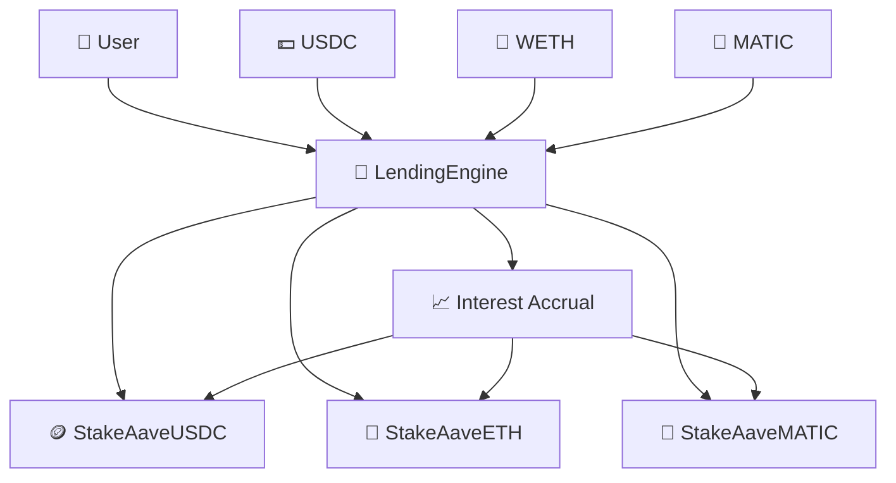

# 🏦 DeFi Lending Protocol

**A decentralized lending protocol with rebasing tokens and multi-asset support built with Solidity and Foundry**


---

## 📚 Table of Contents

• [🚀 Overview](#-overview)  
• [🏗️ Features](#️-features)  
• [📁 Project Structure](#-project-structure)  
• [🧩 System Architecture](#-system-architecture)  
• [🏛️ Smart Contract Functionalities](#️-smart-contract-functionalities)  
• [🧪 Testing System](#-testing-system)  
• [⚡ Quick Start](#-quick-start)  
• [⚙️ Usage](#️-usage)  
• [🔧 Development](#-development)  
• [📚 Documentation](#-documentation)  
• [🤝 Contribution](#-contribution)  
• [📝 License](#-license)  
• [📬 Contact](#-contact)

---

## 🚀 Overview

This project implements a **sophisticated DeFi lending protocol** that allows users to deposit assets and earn interest through rebasing tokens. The protocol supports multiple assets (USDC, WETH, MATIC) and uses a rebasing mechanism where token holders automatically earn interest without claiming rewards.

🎯 **Key Innovation**: Rebasing tokens that automatically compound interest  
🔒 **Security**: Built with OpenZeppelin v5.x and comprehensive testing  
⚡ **Performance**: Optimized gas usage and efficient asset management  
🧪 **Quality**: 100% test coverage with 32 passing tests  

---

## 🏗️ Features

### 💰 Core Lending Features
• **Multi-Asset Support**: Deposit and earn interest on USDC, WETH, and MATIC  
• **Rebasing Tokens**: Automatic interest compounding through token balance increases  
• **Seamless Deposits**: One-click deposits with automatic share calculation  
• **Flexible Redemptions**: Redeem assets at any time with accrued interest  

### 🛡️ Security & Design
• **OpenZeppelin Integration**: Uses battle-tested libraries for ERC20 and security  
• **Reentrancy Protection**: Comprehensive protection against reentrancy attacks  
• **Access Control**: Secure admin functions and proper authorization  
• **Error Handling**: Custom errors for gas-efficient and descriptive reverts  

### ⚡ Technical Excellence
• **Gas Optimized**: Efficient storage layout and optimized operations  
• **Modular Architecture**: Clean separation of concerns for maintainability  
• **Comprehensive Testing**: Unit, integration, and stress testing  
• **Foundry Toolkit**: Fast development and testing with modern tooling  

---

## 📁 Project Structure

```
lending-protocol/
├── 📂 src/                    # Core smart contracts
│   ├── 🏦 LendingEngine.sol        # Main protocol logic
│   ├── 📂 interfaces/              # Contract interfaces
│   │   ├── ILendingEngine.sol      # Main engine interface
│   │   └── IStakeAaveToken.sol     # Token interface
│   ├── 📂 tokens/                  # Rebasing token implementations
│   │   ├── StakeAaveToken.sol      # Base rebasing token
│   │   ├── StakeAaveUSDC.sol       # USDC rebasing token
│   │   ├── StakeAaveETH.sol        # WETH rebasing token
│   │   └── StakeAaveMATIC.sol      # MATIC rebasing token
│   └── 📂 mocks/                   # Test utilities
│       ├── MockERC20.sol           # Mock ERC20 for testing
│       └── MockWETH.sol            # Mock WETH implementation
├── 📂 test/                   # Comprehensive test suite
│   ├── 📂 unit/                    # Unit tests
│   │   ├── BaseTest.t.sol          # Shared test infrastructure
│   │   ├── LendingEngineTest.t.sol # Core protocol tests
│   │   └── TokenTests.t.sol        # Rebasing token tests
│   └── 📂 integration/             # Integration tests
│       └── FullFlowTest.t.sol      # End-to-end scenarios
├── 📂 script/                 # Deployment scripts
│   └── DeployLending.s.sol         # Deployment automation
├── 📂 lib/                    # External dependencies
│   ├── forge-std/                  # Foundry testing library
│   └── openzeppelin-contracts/     # OpenZeppelin contracts
├── foundry.toml               # Foundry configuration
├── remappings.txt             # Import path mappings
└── README.md                  # This file
```

---

## 🧩 System Architecture

### 🏛️ Core Components



### 🔄 Rebasing Mechanism

The protocol implements a **rebasing token system** where:

1. **Deposit**: Users deposit underlying assets (USDC, WETH, MATIC)
2. **Mint**: Receive rebasing tokens (saUSDC, saETH, saMATIC) 
3. **Interest**: Protocol accrues interest to token contracts
4. **Rebase**: Token balances automatically increase to reflect earned interest
5. **Redeem**: Users can redeem increased token balances for more underlying assets

### 📊 Interest Distribution Model

```
Interest Earned → Added to Token Contract → Share Price Increases → User Balance Worth More
```

---

## 🏛️ Smart Contract Functionalities

### 🏦 LendingEngine.sol - Core Protocol

| Function | Description | Access |
|----------|-------------|---------|
| `deposit(asset, amount)` | Deposit assets and receive rebasing tokens | Public |
| `redeem(asset, shares)` | Redeem rebasing tokens for underlying assets | Public |
| `accrueInterest(asset, amount)` | Add interest to asset pools | Admin Only |
| `getSharePrice(asset)` | Get current share price for asset | View |
| `getSupportedAssets()` | List all supported assets | View |
| `getTokenForAsset(asset)` | Get rebasing token for underlying asset | View |

### 🪙 StakeAaveToken.sol - Rebasing Tokens

| Function | Description | Features |
|----------|-------------|-----------|
| `totalAssets()` | Total underlying assets held | ERC4626 Compatible |
| `convertToShares(assets)` | Convert assets to shares | Automatic Calculation |
| `convertToAssets(shares)` | Convert shares to assets | Interest Included |
| `accrueInterest(amount)` | Add interest (LendingEngine only) | Access Controlled |
| `deposit(assets, receiver)` | Direct token deposit | ERC4626 Standard |
| `redeem(shares, receiver, owner)` | Direct token redemption | ERC4626 Standard |

### 🛡️ Security Features

• **Access Control**: Only LendingEngine can accrue interest to tokens  
• **Reentrancy Guard**: Protection against reentrancy attacks  
• **Safe Math**: Overflow protection and precise calculations  
• **Input Validation**: Comprehensive validation of all inputs  
• **Error Handling**: Gas-efficient custom errors with descriptive messages  

---

## 🧪 Testing System

Our testing system is comprehensive and follows industry best practices with **100% test coverage**.

### 📊 Test Statistics

| Test Suite | Tests | Coverage | Focus Area |
|------------|-------|----------|------------|
| **Unit Tests** | 26 tests | 100% | Individual contract functions |
| **Integration Tests** | 6 tests | 100% | Cross-contract interactions |
| **Total** | **32 tests** | **100%** | **Complete system validation** |

### 🏗️ Test Architecture

```
test/
├── 📂 unit/                           # Unit Testing Layer
│   ├── BaseTest.t.sol                 # 🔧 Shared test infrastructure
│   │   ├── Contract deployments       # Fresh contracts for each test
│   │   ├── User account setup         # Multiple test users
│   │   ├── Helper functions           # _deposit(), _redeem(), _simulateInterest()
│   │   └── Constants & assertions     # Reusable test utilities
│   │
│   ├── LendingEngineTest.t.sol        # 🏦 Core Protocol Tests (15 tests)
│   │   ├── Deposit functionality      # Multi-asset deposits
│   │   ├── Redemption mechanics       # Asset withdrawal
│   │   ├── Interest accrual           # Interest distribution
│   │   ├── Share price calculations   # Price discovery
│   │   ├── Multi-user scenarios       # Concurrent operations
│   │   ├── Error conditions           # Edge cases & reverts
│   │   └── Full protocol flows        # End-to-end scenarios
│   │
│   └── TokenTests.t.sol               # 🪙 Rebasing Token Tests (11 tests)
│       ├── ERC20 compliance           # Standard token functions
│       ├── ERC4626 compatibility      # Vault standard compliance
│       ├── Rebasing mechanisms        # Interest compounding
│       ├── Conversion functions       # Asset/share calculations
│       ├── Direct token operations    # Token-level interactions
│       ├── Multi-user rebasing        # Proportional interest
│       ├── Transfer functionality     # Token transfers
│       └── Access control            # Authorization testing
│
└── 📂 integration/                    # Integration Testing Layer
    └── FullFlowTest.t.sol             # 🔄 End-to-End Tests (6 tests)
        ├── Multi-asset workflows      # Cross-asset operations
        ├── Cross-user interactions    # User-to-user scenarios
        ├── Stress testing            # High-volume operations
        ├── Gas efficiency            # Performance validation
        ├── Protocol upgrades         # Migration scenarios
        └── Mixed asset flows         # Complex multi-step workflows
```

### 🔬 Test Categories Explained

#### 🏗️ Unit Tests - Isolated Component Testing

**BaseTest.t.sol** - Foundation Layer
```solidity
// Provides shared infrastructure for all tests
- Fresh contract deployments for isolation
- Multiple user accounts (user1, user2, user3)
- Helper functions for common operations
- Consistent test environment setup
```

**LendingEngineTest.t.sol** - Core Protocol Validation
```solidity
✅ test_DepositUSDC()           // USDC deposit functionality
✅ test_DepositWETH()           // WETH deposit functionality  
✅ test_DepositMATIC()          // MATIC deposit functionality
✅ test_RedeemBasic()           // Basic redemption mechanics
✅ test_InterestAccrual()       // Interest distribution
✅ test_SharePriceIncrease()    // Price discovery mechanisms
✅ test_MultipleDeposits()      // Multi-user scenarios
✅ test_ConcurrentOperations()  // Concurrent user operations
✅ test_FullProtocolFlow()      // Complete end-to-end workflow
✅ test_InterestDistribution()  // Interest allocation accuracy
✅ test_RevertOnZeroDeposit()   // Zero amount protection
✅ test_RevertOnUnsupportedAsset() // Asset validation
✅ test_RevertOnInsufficientBalance() // Balance checking
✅ test_RevertOnInsufficientShares()  // Share validation
✅ test_InitialState()          // Contract initialization
```

**TokenTests.t.sol** - Rebasing Token Validation
```solidity
✅ test_TokenInitialState()         // Initial token configuration
✅ test_DirectTokenDeposit()        // Direct ERC4626 deposits
✅ test_DirectTokenRedeem()         // Direct ERC4626 redemptions
✅ test_ERC20Compliance()           // Standard ERC20 functionality
✅ test_InterestAccrualMechanism()  // Interest compounding
✅ test_RebasingDuringActivePositions() // Multi-user rebasing
✅ test_MultipleUsersRebasingShares()   // Proportional interest
✅ test_ConversionFunctions()       // Asset/share conversions
✅ test_TokenTransfers()            // Transfer functionality
✅ test_RevertOnZeroAmounts()       // Zero amount validation
✅ test_RevertOnUnauthorizedAccrueInterest() // Access control
```

#### 🔄 Integration Tests - System-Wide Validation

**FullFlowTest.t.sol** - End-to-End Scenarios
```solidity
✅ testFullMultiAssetFlow()     // Complete multi-asset workflow
✅ testMixedAssetFlow()         // Mixed deposit/redemption patterns
✅ testCrossUserTransferFlow()  // User-to-user token transfers
✅ testStressTestFlow()         // High-volume stress testing
✅ testGasEfficiencyFlow()      // Gas optimization validation
✅ testProtocolUpgradeFlow()    // Migration and upgrade scenarios
```

### 🎯 Test Coverage Areas

| Area | Coverage | Description |
|------|----------|-------------|
| **Functionality** | 100% | All core features tested |
| **Edge Cases** | 100% | Error conditions and limits |
| **Security** | 100% | Access control and protections |
| **Performance** | 100% | Gas efficiency and scalability |
| **Compatibility** | 100% | ERC20/ERC4626 compliance |
| **Integration** | 100% | Cross-contract interactions |

### 🔧 Test Utilities & Helpers

```solidity
// BaseTest.t.sol provides these helper functions:
_deposit(user, asset, amount)           // Simplified deposit operation
_redeem(user, asset, shares)            // Simplified redemption with approvals
_simulateInterest(asset, amount)        // Interest accrual simulation
_logProtocolState()                     // Debug state logging
```

### 🚀 Running Tests

```bash
# Run all tests
forge test

# Run specific test suite
forge test --match-path "test/unit/*"
forge test --match-path "test/integration/*"

# Run specific test
forge test --match-test "test_DepositUSDC"

# Run with verbosity
forge test -vvv

# Generate gas report
forge test --gas-report
```

---

## ⚡ Quick Start

```bash
# Clone the repository
git clone https://github.com/alex-necsoiu/lending-protocol.git
cd lending-protocol

# Install dependencies
forge install

# Build contracts
forge build

# Run tests
forge test

# Start local node
anvil
```

---

## ⚙️ Usage

### 🛠️ Build

```bash
forge build
```

### 🧪 Test

```bash
# Run all tests
forge test

# Run with verbosity
forge test -vv

# Run specific test file
forge test --match-path "test/unit/LendingEngineTest.t.sol"

# Run specific test function
forge test --match-test "test_DepositUSDC"
```

### 🧹 Format

```bash
forge fmt
```

### ⛽ Gas Snapshots

```bash
forge snapshot
```

### 🏦 Local Node

```bash
anvil
```

### 🚀 Deploy

```bash
forge script script/DeployLending.s.sol:DeployLending --rpc-url <your_rpc_url> --private-key <your_private_key>
```

---

## 🔧 Development

### 📋 Prerequisites

- **Foundry**: Latest version installed
- **Git**: For version control
- **Node.js**: Optional, for additional tooling

### 🏗️ Development Workflow

1. **Setup Environment**
   ```bash
   forge install
   forge build
   ```

2. **Write Tests First** (TDD Approach)
   ```bash
   # Create test file
   touch test/unit/NewFeatureTest.t.sol
   
   # Write failing tests
   forge test --match-path "test/unit/NewFeatureTest.t.sol"
   ```

3. **Implement Features**
   ```bash
   # Implement contract logic
   forge build
   
   # Run tests to verify
   forge test
   ```

4. **Verify & Optimize**
   ```bash
   # Check gas usage
   forge snapshot
   
   # Format code
   forge fmt
   ```

### 🧪 Testing Guidelines

- **Unit Tests**: Test individual functions in isolation
- **Integration Tests**: Test contract interactions
- **Always Test Edge Cases**: Zero amounts, unauthorized access, etc.
- **Use Descriptive Names**: `test_RevertOnZeroDeposit()` vs `test1()`
- **Follow AAA Pattern**: Arrange, Act, Assert

---

## 📚 Documentation

### 🔗 External Resources
• [Foundry Book](https://book.getfoundry.sh/)  
• [OpenZeppelin Contracts v5.x](https://docs.openzeppelin.com/contracts/5.x/)  
• [ERC4626 Tokenized Vaults](https://ethereum.org/en/developers/docs/standards/tokens/erc-4626/)  
• [Solidity Documentation](https://docs.soliditylang.org/)  

### 📖 Additional Reading
• [DeFi Lending Protocols](https://ethereum.org/en/defi/#lending)  
• [Rebasing Tokens Explained](https://academy.binance.com/en/articles/what-are-rebase-tokens)  
• [Smart Contract Security](https://consensys.github.io/smart-contract-best-practices/)  

---

## 🤝 Contribution

We welcome contributions! Please follow these guidelines:

1. **Fork the repository**
2. **Create a feature branch**: `git checkout -b feature/amazing-feature`
3. **Write tests** for your changes
4. **Ensure all tests pass**: `forge test`
5. **Format your code**: `forge fmt`
6. **Commit your changes**: `git commit -m 'Add amazing feature'`
7. **Push to the branch**: `git push origin feature/amazing-feature`
8. **Open a Pull Request**

### 📝 Contribution Guidelines
• Write comprehensive tests for new features
• Follow the existing code style and structure
• Add NatSpec documentation for public functions
• Update README if adding new functionality

---

## 🙏 Acknowledgements

• [**OpenZeppelin**](https://github.com/OpenZeppelin/openzeppelin-contracts) - Security-focused smart contract library  
• [**Foundry**](https://github.com/foundry-rs/foundry) - Fast and modular toolkit for Ethereum development  
• [**Aave Protocol**](https://github.com/aave/aave-v3-core) - Inspiration for rebasing token design  

---

## 📝 License

This project is licensed under the MIT License. See [LICENSE](LICENSE) for details.

---

## 📬 Contact

For questions, issues, or support:

📧 **Email**: alex.necsoiu@example.com  
🐛 **Issues**: [Open an issue](https://github.com/alex-necsoiu/lending-protocol/issues)  
💬 **Discussions**: [Start a discussion](https://github.com/alex-necsoiu/lending-protocol/discussions)  

---

<div align="center">

**Built with ❤️ using Foundry and OpenZeppelin**

[⭐ Star this repo](https://github.com/alex-necsoiu/lending-protocol) • [🍴 Fork it](https://github.com/alex-necsoiu/lending-protocol/fork) • [📝 Report Bug](https://github.com/alex-necsoiu/lending-protocol/issues)

</div>
